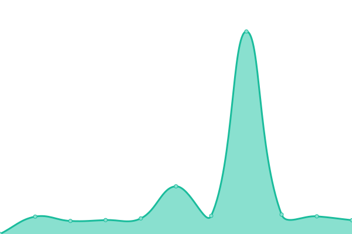

# [📈 Live Status](https://aafyyuc.github.io/upptime): <!--live status--> **🟩 All systems operational**

This repository contains the open-source uptime monitor and status page for [AAFY](https://aafyyuc.github.io/upptime), powered by [Upptime](https://github.com/upptime/upptime).

With [Upptime](https://upptime.js.org), you can get your own unlimited and free uptime monitor and status page, powered entirely by a GitHub repository. We use [Issues](https://github.com/aafyyuc/upptime/issues) as incident reports, [Actions](https://github.com/aafyyuc/upptime/actions) as uptime monitors, and [Pages](https://aafyyuc.github.io/upptime) for the status page.

<!--start: status pages-->
<!-- This summary is generated by Upptime (https://github.com/upptime/upptime) -->
<!-- Do not edit this manually, your changes will be overwritten -->
<!-- prettier-ignore -->
| URL | Status | History | Response Time | Uptime |
| --- | ------ | ------- | ------------- | ------ |
|  [AAFY PDP](https://pagos.yucatan.gob.mx) | 🟩 Up | [aafy-pdp.yml](https://github.com/aafyyuc/upptime/commits/HEAD/history/aafy-pdp.yml) | 

 777ms
     
 | 

<a href="https://aafyyuc.github.io/upptime/history/aafy-pdp">100.00%</a>
    

|  [AAFY Referenciados](https://pagosreferencia.yucatan.gob.mx) | 🟩 Up | [aafy-referenciados.yml](https://github.com/aafyyuc/upptime/commits/HEAD/history/aafy-referenciados.yml) | 

 816ms
     
 | 

<a href="https://aafyyuc.github.io/upptime/history/aafy-referenciados">100.00%</a>
    

|  [AAFY Home](https://aafy.yucatan.gob.mx) | 🟩 Up | [aafy-home.yml](https://github.com/aafyyuc/upptime/commits/HEAD/history/aafy-home.yml) | 

 723ms
     
 | 

<a href="https://aafyyuc.github.io/upptime/history/aafy-home">100.00%</a>
    

|  [AAFY CFDI](https://srvshyws.yucatan.gob.mx/cfdi2.0/) | 🟩 Up | [aafy-cfdi.yml](https://github.com/aafyyuc/upptime/commits/HEAD/history/aafy-cfdi.yml) | 

 706ms
     
 | 

<a href="https://aafyyuc.github.io/upptime/history/aafy-cfdi">99.24%</a>
    

|  [KIOSKOS - HOME](https://recaudacion.yucatan.gob.mx) | 🟩 Up | [kioskos-home.yml](https://github.com/aafyyuc/upptime/commits/HEAD/history/kioskos-home.yml) | 

 1218ms
     
 | 

<a href="https://aafyyuc.github.io/upptime/history/kioskos-home">96.05%</a>
    

|  [SERVICOS VUE](https://wsaafyvue.yucatan.gob.mx/vue/services/consultar/recibos) | 🟩 Up | [servicos-vue.yml](https://github.com/aafyyuc/upptime/commits/HEAD/history/servicos-vue.yml) | 

 750ms
     
 | 

<a href="https://aafyyuc.github.io/upptime/history/servicos-vue">99.66%</a>
    

|  [WSINGRESOS - OXXO](https://srvshyweb.yucatan.gob.mx/cgi-bin/wspd_cgi.sh/WService=wsingresos/internet/compartido/wspagosoxxo.r) | 🟩 Up | [wsingresos-oxxo.yml](https://github.com/aafyyuc/upptime/commits/HEAD/history/wsingresos-oxxo.yml) | 

 651ms
     
 | 

<a href="https://aafyyuc.github.io/upptime/history/wsingresos-oxxo">99.48%</a>
    

|  [WSINGRESOS - RECIBOPAGO](https://srvshyweb.yucatan.gob.mx/cgi-bin/wspd_cgi.sh/WService=wsingresos/internet/servicios/wsRecibosPagosWeb.r) | 🟩 Up | [wsingresos-recibopago.yml](https://github.com/aafyyuc/upptime/commits/HEAD/history/wsingresos-recibopago.yml) | 

 257ms
     
 | 

<a href="https://aafyyuc.github.io/upptime/history/wsingresos-recibopago">99.73%</a>
    

|  [WSINGRESOS - GENERICO](https://srvshyweb.yucatan.gob.mx/cgi-bin/wspd_cgi.sh/WService=wsingresos/internet/servicios/wsGenericoPagosWeb.r) | 🟩 Up | [wsingresos-generico.yml](https://github.com/aafyyuc/upptime/commits/HEAD/history/wsingresos-generico.yml) | 

 389ms
     
 | 

<a href="https://aafyyuc.github.io/upptime/history/wsingresos-generico">99.75%</a>
    

|  [Reemplacamiento Yuc](https://reemplacamiento.yucatan.gob.mx) | 🟩 Up | [reemplacamiento-yuc.yml](https://github.com/aafyyuc/upptime/commits/HEAD/history/reemplacamiento-yuc.yml) | 

 1052ms
     
 | 

<a href="https://aafyyuc.github.io/upptime/history/reemplacamiento-yuc">99.09%</a>
    

|  [awardspace - ping](http://www.dpechcutz.dx.am/services/phpprocessparams.php) | 🟩 Up | [awardspace-ping.yml](https://github.com/aafyyuc/upptime/commits/HEAD/history/awardspace-ping.yml) | 

 740ms
     
 | 

<a href="https://aafyyuc.github.io/upptime/history/awardspace-ping">100.00%</a>
    

<!--end: status pages-->

[**Visit our status website →**](https://aafyyuc.github.io/upptime)

## 📄 License

- Powered by: [Upptime](https://github.com/upptime/upptime)
- Code: [MIT](./LICENSE) © [AAFY](https://aafyyuc.github.io/upptime)
- Data in the `./history` directory: [Open Database License](https://opendatacommons.org/licenses/odbl/1-0/)
